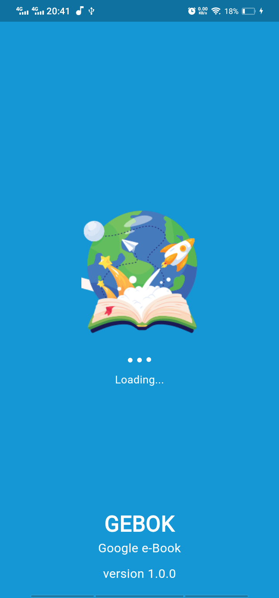
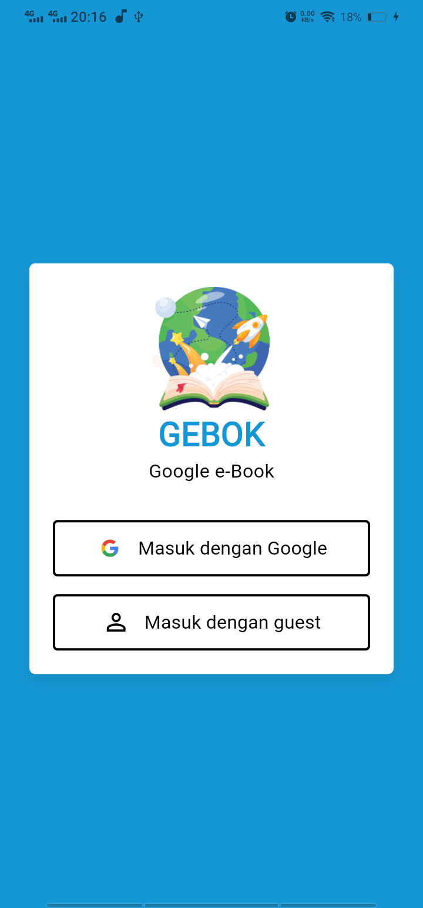

# 📘 GEBOK (Google e-Book)

GEBOK atau **Google e-Book** adalah aplikasi Flutter yang saya kembangkan sebagai sarana latihan untuk memperdalam keterampilan saya dalam pengembangan aplikasi menggunakan **Flutter**. Fokus utama dari proyek ini adalah penerapan arsitektur **Clean Architecture** yang dikombinasikan dengan pendekatan **DDD (Domain-Driven Design)**. Selain itu, saya juga menerapkan manajemen state menggunakan **BLoC Pattern** dengan bantuan library `bloc`.

## 🚀 Tujuan Pengembangan

- Menerapkan **Clean Architecture** dengan struktur kode yang rapi dan modular.
- Mengenal dan mempraktikkan konsep **Domain-Driven Design (DDD)**.
- Mengelola **state** aplikasi dengan efektif menggunakan **BLoC**.
- Mencoba **OAuth 2.0** menggunakan Google sebagai penyedia layanan login secara gratis.

Walaupun implementasi OAuth ini belum sepenuhnya sempurna, saya bangga karena sudah memiliki **pondasi awal** untuk pengembangan autentikasi yang lebih baik ke depannya. Yang penting jalan dulu, perbaiki sambil belajar 😁.

---

## 🧠 Teknologi & Arsitektur

- **Flutter** (UI Toolkit)
- **Clean Architecture**
- **Domain-Driven Design (DDD)**
- **BLoC State Management** (`flutter_bloc`)
- **Google OAuth 2.0** (Login)

---

## 📸 Tampilan Aplikasi

<figure>
  
  <figcaption><strong>Gambar 1:</strong> Tampilan halaman beranda aplikasi GEBOK yang menampilkan daftar buku digital.</figcaption>
</figure>

<figure>
  
  <figcaption><strong>Gambar 2:</strong> Halaman login menggunakan OAuth Google. Ini adalah implementasi awal yang masih akan terus dikembangkan.</figcaption>
</figure>

<figure>
  
  <figcaption><strong>Gambar 3:</strong> Halaman beranda aplikasi baik user maupun guest.</figcaption>
</figure>

<figure>
  
  <figcaption><strong>Gambar 4:</strong> Tampilan detail buku yang dinamis, ada fitur share dan whistlist bagi user.</figcaption>
</figure>

<figure>
  
  <figcaption><strong>Gambar 5:</strong> Tampilan untuk mendownload sampul buku.</figcaption>
</figure>

<figure>
  
  <figcaption><strong>Gambar 6:</strong> Tampilan search buku apapun!</figcaption>
</figure>

<figure>
  
  <figcaption><strong>Gambar 7:</strong> Tampilan filter untuk search buku.</figcaption>
</figure>

<figure>
  
  <figcaption><strong>Gambar 8:</strong> Tampilan hasil search buku, memiliki kemapuan untuk infinity scroll!.</figcaption>
</figure>

<figure>
  
  <figcaption><strong>Gambar 9:</strong> List genre-genre.</figcaption>
</figure>


<figure>
  
  <figcaption><strong>Gambar 10:</strong> Tampilan halaman wishlist untuk user.</figcaption>
</figure>

---

## 🔧 Cara Menjalankan Proyek

```bash
git clone https://github.com/gioVerdiansyah/GEBOK.git
cd gebok
flutter pub get
flutter run
